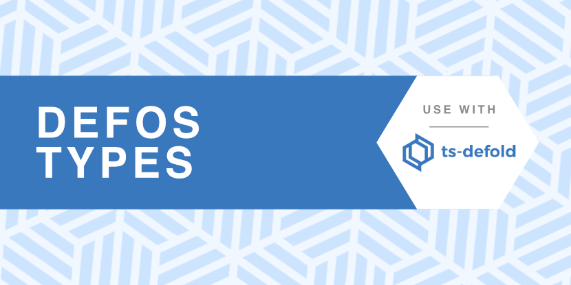

# @types/tsd-defos

<a href="https://discord.gg/eukcq5m"></a>

TypeScript types for subsoap's [DefOS](https://github.com/subsoap/defos), extra native OS functions for games written using the Defold game engine.

For use with [TS-Defold](https://github.com/ts-defold) and [TypeScriptToLua](https://github.com/TypeScriptToLua).

## Installation

```bash
yarn add git+https://git@github.com/thinknathan/tsd-defos-types.git#^1.0.0 -D
# or
npm install git+https://git@github.com/thinknathan/tsd-defos-types.git#^1.0.0 --save-dev
```

- Add `tsd-defos` to `types` in `tsconfig.json`

```diff
{
	"compilerOptions": {
		"types": [
+			"tsd-defos",
		],
	}
}
```

- Add `node_modules/@types` to `typeRoots` in `tsconfig.json` if it's not already there

```diff
{
	"compilerOptions": {
		"typeRoots": [
+			"node_modules/@types",
		],
	}
}
```

<p align="center" class="h4">
  TypeScript :heart: Defold
</p>
